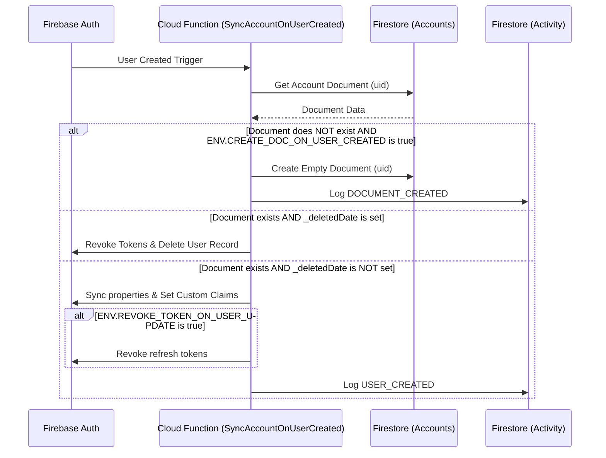
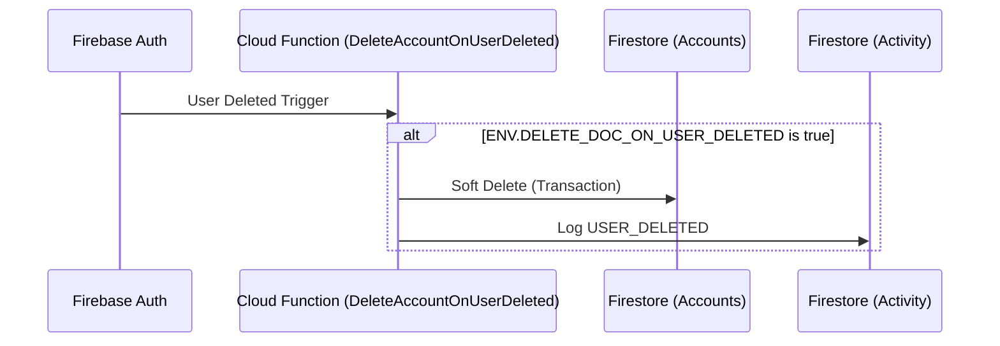
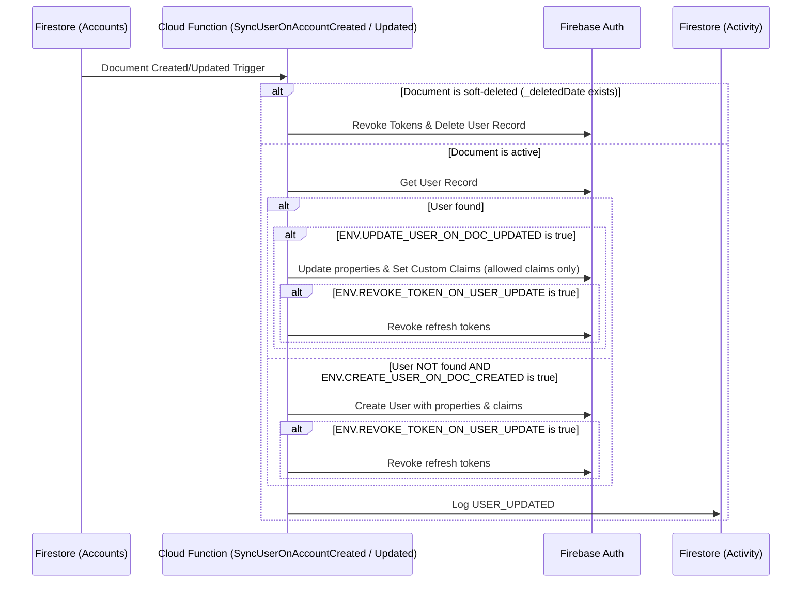
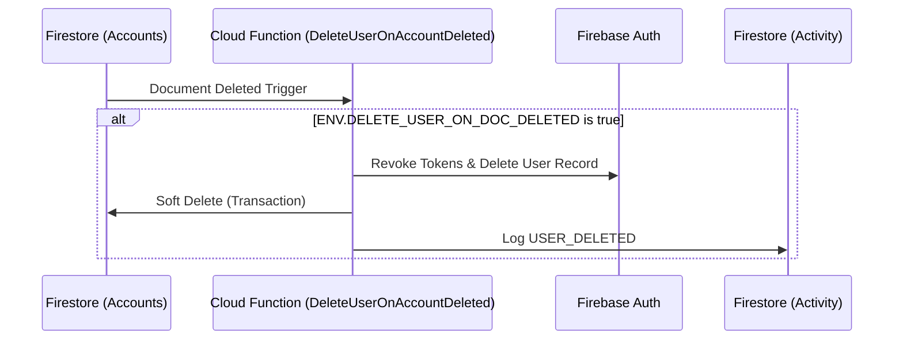

### Firestore ↔ Authentication IAM Extension

**Author**: Vidush H. Namah   
**Source**: https://github.com/orion-next/firebase-firestore-iam

Keep Firebase Authentication users and Firestore account documents synchronized.

This extension synchronizes Firebase Authentication with Firestore account documents. It ensures that user properties and claims remain consistent across both systems, while providing audit trails and lifecycle management.

| Event | Details |
| :- | :- |
|    |    |
| **Authentication Events** | - |
| Firebase User Creation &nbsp;&nbsp;&nbsp;&nbsp;&nbsp;&nbsp;&nbsp; | Ensures a corresponding Firestore document exists |
| Firebase User Deletion    | (Optional) Soft deletes the Firestore document by setting `_deletedDate` |
|    |    |
| **Firestore Events** | - |
| Document Creation/Update | Updates Firebase user properties and custom claims |
| Document Deletion        | Deletes the Firebase user and soft deletes the Firestore document |

Built on top of the event-based synchronization logic:
- Claims defined via `claims` field in account documents are synchronized to custom claims.
- Automated actions are logged via document entries and cloud logging.
  - Record event logs to sub-collection per account document.
  - Record function logs.

### Sequence Diagrams

The following diagrams outline the synchronization logic for each trigger.

#### 1. Authentication: User Created
Triggers when a new user is created in Firebase Authentication.

#### 2. Authentication: User Deleted
Triggers when a user is deleted from Firebase Authentication.

#### 3. Firestore: Account Created / Updated
Triggers when an account document is created or updated in the `Accounts` collection.

#### 4. Firestore: Account Deleted
Triggers when an account document is deleted from Firestore.

#### Additional Parameters

The following parameters may be configured.
| Parameter | Details |
| :- | :- |
| Cloud Functions Location | Deployment location for the functions created |
| Soft Delete Behaviour | Whether to soft delete the account document when a user is deleted |
| Token Management Behavior | Whether to revoke refresh tokens when a user is updated |
| Allowed claims | Comma-separated list of claims that can be set on users. |

#### Google API Usage

| API | Reason |
| :- | :- |
| firebaseauth.googleapis.com | Manage Firebase Authentication users |
| firestore.googleapis.com | Read/write account documents and event logs |

#### Billing

To install this extension, your project must be on the [Blaze (pay as you go)](https://firebase.google.com/pricing) plan.
- You will be charged a small amount (typically around $0.01/month) for the Firebase resources required by this extension (even if it is not used).
- This extension uses other Firebase and Google Cloud Platform services, which may have associated charges if you exceed the service’s no‑cost tier:
  - Cloud Functions for synchronization triggers.
  - Firestore for account documents and audit logs.

The following table provides estimates for Cloud Function invocations and Firestore document operations per event, accounting for cascading processes (default configuration).

| Operation | Function Invocations | Firestore Reads | Firestore Writes |
| :--- | :---: | :---: | :---: |
| **User Sign-Up** (Public)  `BeforeUserCreation` + `SyncAccountOnUserCreated` | 3 | 2 | 3 |
| **User Sign-Up** (Pre-allocated)  `BeforeUserCreation` + `SyncAccountOnUserCreated` | 2 | 2 | 1 |
| **Firestore Doc Update**  `SyncUserOnAccountUpdated` | 1 | 0 | 1 |
| **Auth User Deletion**  `DeleteAccountOnUserDeleted` | 1 | 1 | 2 |
| **Firestore Doc Deletion**  `DeleteUserOnAccountDeleted` | 1 | 1 | 2 |

> [!NOTE]
> Estimates assume public sign-up is not allowed and default synchronization settings.

#### Post Installation
Ensure that the service account bound to the extension has the right to manage documents and authentication.   
Example: `Firebase Admin` role.
- The associated service account can be found in Google Cloud Console > IAM > Service Accounts
- It can be one of the following accounts (in cascading order):
  - `ext-firebase-firestore-iam@<project-id>.iam.gserviceaccount.com`
  - `<project-number>-compute@developer.gserviceaccount.com`
  - `<project-id>@appsport.gserviceaccount.com` 

---
